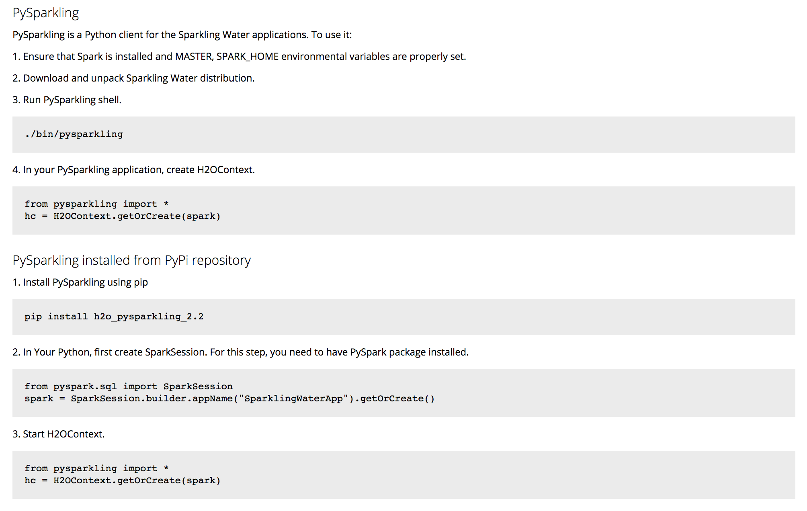

H2O’s AutoML in Spark
=====================

This blog post demonstrates how H2O’s powerful automatic machine learning can be used together with the Spark in Sparkling Water.

We show the benefits of Spark & H2O integration, use Spark for data munging tasks and H2O for the modelling phase, where all
these steps are wrapped inside a Spark Pipeline. The integration between Spark and H2O can be see on the figure bellow.
All technical details behind this integration are explained in our documentation which you can access from `http://docs.h2o.ai/ <http://docs.h2o.ai/>`__.

.. image:: internal_backend.png

At the end of this blog post, we also show how the generated model can be taken into production using Spark Streaming application.
We use Python and PySparkling for model training phase and Scala for the deployment example.

For the purpose of this blog, we use the `Combined Cycle Power Plant dataset <https://archive.ics.uci.edu/ml/datasets/Combined+Cycle+Power+Plant>`__.
The goal here is to predict the energy output (in megawatts), given the temperature, ambient pressure, relative humidity
and exhaust vacuum values. We will alter the dataset a little bit for the blog post purposes and use only rows where temperature
is higher then 10 degrees celsius. This can be explained such as that we are interested just in plant performance in the warmer days.

Obtain Sparkling Water
----------------------
First step is to download Sparkling Water. It can be downloaded from our official download page
at `https://www.h2o.ai/download/ <https://www.h2o.ai/download/>`__. Please make sure to use the latest Sparkling Water
as the H2OAutoml in Sparkling Water is a fairly new feature available in the latest versions.
Once you downloaded the Sparkling Water, please follow the instructions on the PySparkling tab on how to start PySparkling interpreter.

Start Sparkling Water
---------------------
In order to be able to use both Spark and H2O alongside, we need to make H2O available inside the Spark cluster. This can be achieved by
running the code bellow.

.. code:: python

    from pysparkling import * # Import PySparkling
    hc = H2OContext.getOrCreate(spark) # Start the H2OContext

This code starts H2O node on each spark executor and special H2O node called client node inside the Spark driver.

Load Data into Sparkling Water
------------------------------
We use Spark to load the data into memory. For that, we can use the line bellow:

.. code:: python

    powerplant_df = spark.read.option("inferSchema", "true").csv("powerplant_output.csv", header=True)

This code imports the file from the specified location into the Spark cluster and creates a Spark Dataframe from it.
The original datafile can be downloaded from `powerplant_output.csv <https://github.com/h2oai/h2o-tutorials/raw/master/h2o-world-2017/automl/data/powerplant_output.csv>`__.
It is important to specify the ``inferSchema`` option to ``true`` because otherwise, Spark won’t try to automatically infer the data types
and we will have all columns with type String. This way, the types are correctly inferred.

We will use portion of this data for the training purposes and portion for demonstrating the predictions. We can use ``randomSplit``
method available on the Spark Dataframe to split the data as:

.. code:: python

    splits = powerplant_df.randomSplit([0.8, 0.2], 1)
    train = splits[0]
    for_predictions = splits[1]

We split the dataset and give 80% to one split and 20% to another. The last argument specifies the seed to the method can behave
deterministically. We use the 80% part for the training purposes and the second part for scoring later.

Define the Pipeline with H2O AutoML
-----------------------------------

Now, we can define the Spark pipeline containing the H2O AutoML. Before we do that, we need to do a few imports so all classes and
methods we require are available:

.. code:: python

    from pysparkling.ml import H2OAutoML
    from pyspark.ml import Pipeline
    from pyspark.ml.feature import SQLTransformer

And finally, we can start building the pipeline stages. The first pipeline stage is the ``SQLTransformer`` used for selecting
the rows where the temperature is higher than 10 degrees celsius. The ``SQLTransformer`` is powerful Spark transformer
where we can specify any Spark SQL code which we want to execute on the dataframe passed to from the pipeline.

.. code:: python

    temperatureTransformer = SQLTransformer(statement="SELECT * FROM __THIS__ WHERE TemperatureCelcius > 10")

It is important to understand that no code is executed at this stage as we are just defining the stages. We will show how
to execute the whole pipeline later in the blog post.

The next pipeline stage is not transformer, but estimator and is used for creating the H2O model using the H2O AutoML
algorithm. This estimator is provided by the Sparkling Water library, but we can see that the API is unified with the other
Spark pipeline stages.

.. code:: python

    automlEstimator = H2OAutoML(maxRuntimeSecs=60, predictionCol="HourlyEnergyOutputMW", ratio=0.9)

We defined the H2OAutoML estimator. The ``maxRuntimeSecs`` argument specifies how long we want to run the automl algorithm.
The ``predictionCol`` specifies the response column and the ``ratio`` argument specifies how big part of dataset is used for the training purposes.
We specified that we want to use 90% of data for training purposes and 10% of data for the validation.

As we have defined the both stages we need, we can define the whole pipeline:

.. code:: python

    pipeline = Pipeline(stages=[temperatureTransformer, automlEstimator])

And finally, train it on on the training dataset we prepared above:

.. code:: python

    model = automlEstimator.fit(df)

This call goes through all the pipeline stages and in case of estimators, creates a model. So as part of this call, we run the
H2O automl algorithm and find the best model given the search criteria we specified in the arguments. The ``model`` variable
contains the whole Spark pipeline model, which also internally contains the model found by automl. The H2O model stored inside is stored as
MOJO. That means that it is independent on H2O runtime and we can run it anywhere without setting up H2O cluster. For more information about MOJO,
please visit the `MOJO documentation <http://docs.h2o.ai/h2o/latest-stable/h2o-docs/productionizing.html#about-pojo-mojo>`__.

Run predictions
---------------

We can run the predictions on the returned model simply as:

.. code:: python

    predicted = model.transform(for_predictions)

This call again goes through all the pipeline stages and in case it hits a stage with a model, it performs a scoring
operation.

We can also see a few first results as:

.. code:: python

    predicted.take(2)

Export the model for the deployment
-----------------------------------

In the following part of the blog post, we show how to put this model into production. For that, we need to export the model, which can be
done simply as:

.. code:: python

    model.write().overwrite().save("pipeline.model")

This call will store the model into the ``pipeline.model`` file. It is also helpful trick to export schema of the data. This is
especially useful in case sof streaming applications where it's hard to determine the type of data based on a single row in the input.

We can export the schema as:

.. code:: python

    with open('schema.json','w') as f:
        f.write(str(powerplant_df.schema.json()))

Deploy the model
----------------

Now, we would like to demonstrate how the Spark pipeline with model found by automl can be put into production in case of
Spark Streaming application. For the deployment, we can start a new Spark application, it can be in Scala or Python and we can load the trained pipeline model.
The pipeline model contains the H2O automl model packaged as MOJO and therefore, it is independent on the H2O runtime. We will use Scala to demonstrate the language independence
of the exported pipeline.

The deployment consist of several steps:

    - Load the schema from the schema file
    - Create input data stream and pass it the schema. The input data stream will point to a directory where a new csv files will be comming from different streaming sources. It can also be a on-line source of streaming data.
    - Load the pipeline from the pipeline file
    - Create output data stream. For our purposes, we store the data into memory and also to a SparkSQL table so we can se immediate results

.. code:: scala

	  // Start Spark
 	  val spark = SparkSession.builder().master("local").getOrCreate()

      //
      // Load exported pipeline
      //
      import org.apache.spark.sql.types.DataType
      val pipelineModel = PipelineModel.read.load("pipeline.model")

      //
      // Load exported schema of input data
      //
      val schema = StructType(DataType.fromJson(scala.io.Source.fromFile("schema.json").mkString).asInstanceOf[StructType].map {
        case StructField(name, dtype, nullable, metadata) => StructField(name, dtype, true, metadata)
        case rec => rec
      })
      println(schema)

      //
      // Define input stream
      //
      val inputDataStream = spark.readStream.schema(schema).csv("/path/to/folder/where/input/data/are/being/generated")

      //
      // Apply loaded model
      //
      val outputDataStream = pipelineModel.transform(inputDataStream)

      //
      // Forward output stream into memory-sink
      //
      outputDataStream.writeStream.format("memory").queryName("predictions").start()

      //
      // Query results
      //
      while(true){
        spark.sql("select * from predictions").show()
        Thread.sleep(5000)
      }

Conclusion
----------

This code demonstrates that we can relatively easily put a pipeline model into production. We used Python for the model creation
and JVM-based language for the deployment. The resulting pipeline model contains model found by H2O automl algorithm, exported as MOJO.
This means that we don't need to start H2O or Sparkling Water in place where we deploy the model (but we need to ensure that Sparkling Water dependencies are on the classpath).